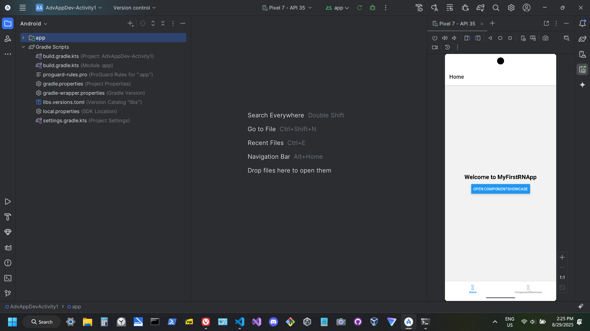
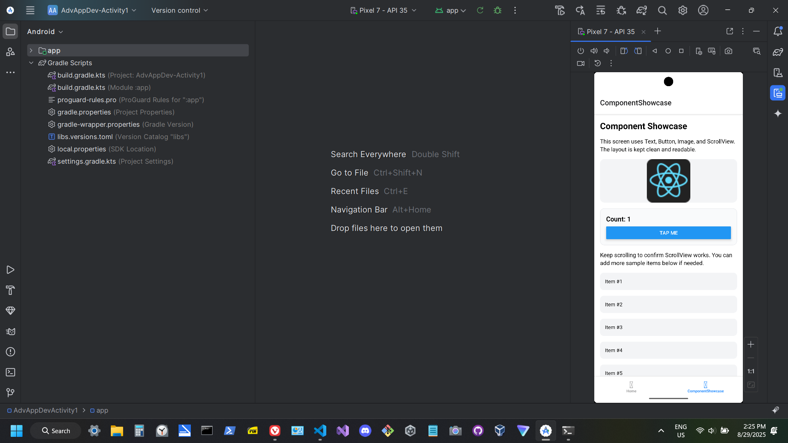
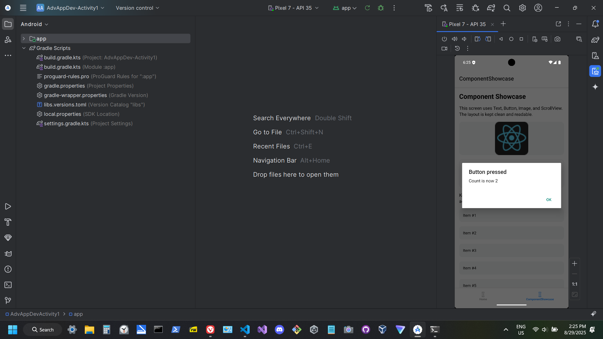
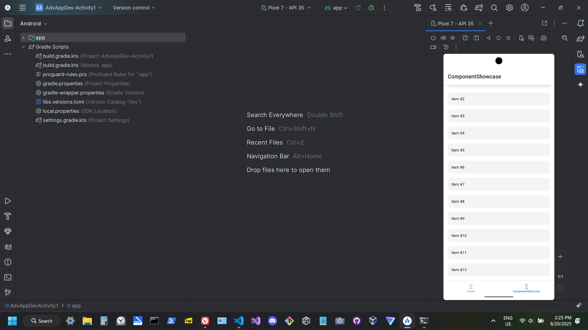

List of installs for plugins used:
npm install react-native
npm install react

npm install @react-navigation/native
npm install @react-navigation/stack
npm install @react-navigation/drawer

npm install react-native-screens react-native-safe-area-context
npm install react-native-gesture-handler react-native-reanimated
npm i react-native-gesture-handler react-native-screens 

npm install @react-native-async-storage/async-storage

npm install react-native-reanimated

npm install react-native-linear-gradient
npm install react-native-vector-icons

1) Name
2) BSIT - 3
3) Link - [github project](https://github.com/braindeadLee/React-Native-Android-Spotify-App-Project)
4) Subject : IT5103N - Group2 - Advanced Mobile Development

# Screenshots

1. Home Screen  

2. Button "Tap Me"  

3. Button Pressed With Popup  

4. Scrolling Down the App  
